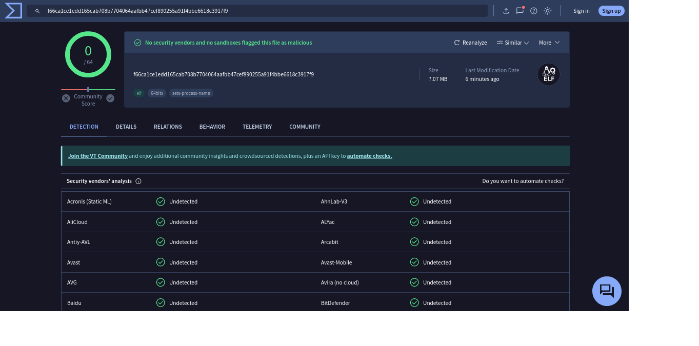

# Keylogger

This is a simple keylogger program written in python, designed for [purpose]. It captures keystrokes from the keyboard and logs them to a file.

## Features

- Capture keystrokes from the keyboard.
- Store logged keystrokes in a file.
- [Add more features if applicable] // without console 

## Installation
pip install pynput
pip install pyinstaller
python3 keylg.py

## VT Score

The screenshot above shows the results of the keylogger on VirusTotal, where it received a score of 0/64, indicating that it was not detected as malicious by any of the antivirus engines.

